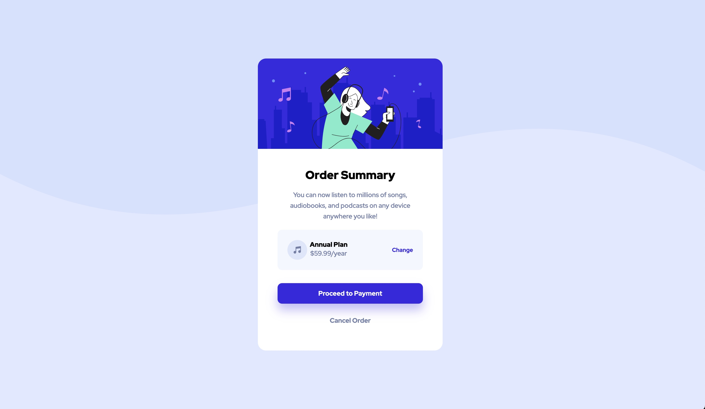

# Frontend Mentor - order summary component solution

This is a solution to the [Results order component challenge on Frontend Mentor](https://www.frontendmentor.io/challenges/order-summary-component-QlPmajDUj/hub). Frontend Mentor challenges help you improve your coding skills by building realistic projects.

## Table of contents

- [Overview](#overview)
    - [The challenge](#the-challenge)
    - [Screenshot](#screenshot)
    - [Links](#links)
- [My process](#my-process)
    - [Built with](#built-with)
    - [What I learned](#what-i-learned)
    - [Continued development](#continued-development)
    - [Useful resources](#useful-resources)
- [Author](#author)
- [Acknowledgments](#acknowledgments)

## Overview

### The challenge

Users should be able to:

- View the optimal layout for the interface depending on their device's screen size
- See hover and focus states for all interactive elements on the page

### Screenshot



### Links

- Solution URL: [click me](https://github.com/yxlaisj/order-summary-component)
- Live Site URL: [click me](https://yxlaisj.github.io/order-summary-component/)

## My process

### Built with

- Semantic HTML5 markup
- CSS custom properties
- Flexbox
- Responsive

### What I learned

- use css flex box
- make responsible layout
- use figma

```html

```
```css

```
```js

```

## Author

- Github - [yxlaisj](https://github.com/yxlaisj)
- Frontend Mentor - [@yxlaisj](https://www.frontendmentor.io/profile/yxlaisj)
